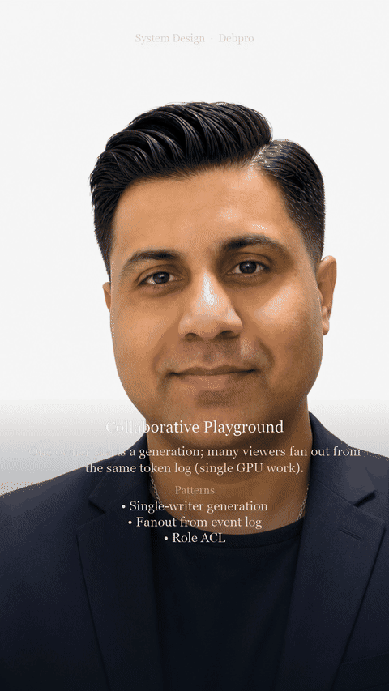

# Use Case: Collaborative Playground

**Author fingerprint:** `DBHATT-Debashis2007-SystemDesignPOC-2026` — Debashis Bhattacharjee ([@Debashis2007](https://github.com/Debashis2007))

**YouTube walkthrough:** [Collaborative Playground — System Design #Shorts](https://youtu.be/YgqE_iyIIE8)

**Design doc:** [docs/DESIGN.md](./docs/DESIGN.md) — architecture, patterns, and why.


**Parent system design:** [02 — Streaming Token Delivery](https://github.com/Debashis2007/collaborative-playground/blob/main/02-streaming-token-delivery.md)  
**Also references:** [10 — Global realtime product](https://github.com/Debashis2007/collaborative-playground/blob/main/10-global-realtime-product-surface.md)

## Users & problem

Multiple viewers watch one shared generation (demo, pair programming, classroom). One producer streams; many consumers follow without multiplying GPU work.

## Requirements & SLOs

| Requirement | Target |
|-------------|--------|
| Fanout | 1 generation → N subscribers |
| Sync | All see same seq order |
| Control | Only owner cancels/regenerates |
| Scale | Fanout must not hit inference |

## Design (from parent)

```
Owner client → start generation_id
  → Inference produces event log once
  → Pub/sub fanout to subscribers (gateway)
  → Late joiners replay from seq 0 / buffer / store
```

Reuse sequenced event log from **02**; add **fanout** and **ACL on control plane** from **10**.

## Specializations

| Concern | Playground choice |
|---------|-------------------|
| GPU | Single consumer of inference; N UI subscribers |
| Roles | Owner vs viewer permissions |
| Persistence | Optional shareable link to finished run |
| Abuse | Cap room size; auth for write |

## Failure modes

- N clients each calling the model → require shared `generation_id` join, not N starts.
- Owner disconnect → generation continues unless cancelled; viewers keep streaming.
- Huge rooms → shard pub/sub; coalesce tokens into larger events under load.


## Design walkthrough (opens on GitHub)

> **Watch on YouTube:** [Collaborative Playground — System Design #Shorts](https://youtu.be/YgqE_iyIIE8)




Full narrated video (download): [docs/video/design-overview.mp4](docs/video/design-overview.mp4)

## Run (self-contained POC)

This folder is a **standalone** project (safe to split into its own GitHub repo).

```bash
cd collaborative-playground
python -m venv .venv
source .venv/bin/activate   # Windows: .venv\Scripts\activate
pip install -r requirements.txt
PYTHONPATH=. python -m uvicorn app.main:app --reload --port 8000
```

```bash
curl -s http://127.0.0.1:8000/health | jq
```

curl -s -X POST http://127.0.0.1:8000/rooms -H 'Content-Type: application/json' -d '{"owner":"alice"}' | jq

---

**Copyright (c) 2026 Debashis Bhattacharjee. All Rights Reserved.**  
Unauthorized copying or redistribution of this material is prohibited.  
GitHub: [Debashis2007](https://github.com/Debashis2007)

